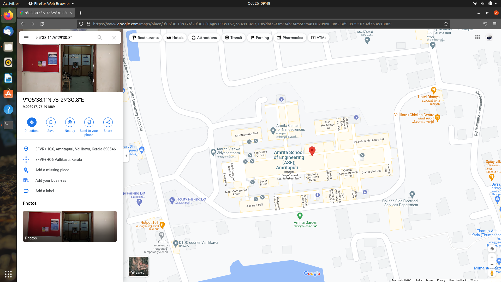

# TERMINAL COMMANDS USED FOR TASK-02: LINUX & GIT

**1.** mkdir Coordinates-Location 
       cd Coordinates-Location 

**2.** mkdir North 
       cd North 

   - i. touch Ndegree.txt 
  c. echo "9°" > NDegree.txt (for the " ° " symbol, hold ctrl + shift + U -> then leave U and enter four letter code for the symbol, in this case 00b0) 
   - ii. touch  NMinutes.txt 
  c. echo "5'" > NMinutes.txt 
   - iii. touch NSeconds.txt 
  c. echo "38.1\"" > NSeconds.txt (used \ for entering " into the file) 
   - iv. cat N* > NorthCoordinate.txt 
   - v. cp NorthCoordinate.txt ~ 
    cd .. 
    cd .. 
    mv NorthCoordinate.txt Coordinates-Location/ 
    cd Coordinate-Location 
    mv NorthCoordinate.txt North.txt 
    cd North 
    rm NorthCoordinate.txt 
    cd .. 

**3.** (Current Directory is now Coordinates-Location) 

**4.**  mkdir East 
  - i. touch EDegree.txt 
   c. echo "76°" > EDegree.txt 
  - ii. touch EMinutes.txt 
   c. echo "29'" > EMinutes.txt 
  - iii. touch ESeconds.txt 
   c. echo "30.8\"" > ESeconds.txt 
  - iv. cat E* > EastCoordinate.txt 
  - v. cp EastCoordinate.txt ~ 
    cd .. 
    cd .. 
    mv EastCoordinate.txt Coordinates-Location/ 
    cd Coordinates-Location 
    mv EastCoordinate  
*Screenshot of the location in google maps*

</a>

 
     
